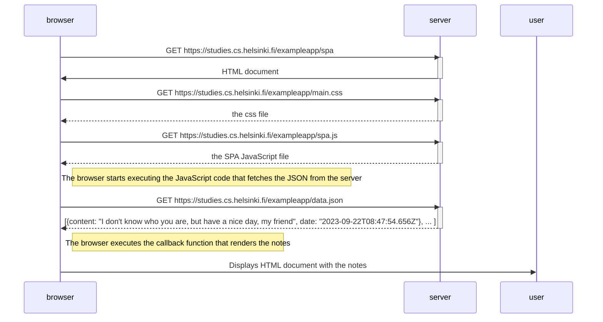

```mermaid
sequenceDiagram
  participant browser
  participant server
  participant user

  browser->>server: GET https://studies.cs.helsinki.fi/exampleapp/spa
  activate server
  server->>browser: HTML document
  deactivate server

  browser->>server: GET https://studies.cs.helsinki.fi/exampleapp/main.css
  activate server
  server-->>browser: the css file
  deactivate server

  browser->>server: GET https://studies.cs.helsinki.fi/exampleapp/spa.js
  activate server
  server-->>browser: the SPA JavaScript file
  deactivate server

  Note right of browser: The browser starts executing the JavaScript code that fetches the JSON from the server

  browser->>server: GET https://studies.cs.helsinki.fi/exampleapp/data.json
  activate server
  server-->>browser: [{content: "I don't know who you are, but have a nice day, my friend", date: "2023-09-22T08:47:54.656Z"}, ... ]
  deactivate server

  Note right of browser: The browser executes the callback function that renders the notes

  browser->>user: Displays HTML document with the notes
```
