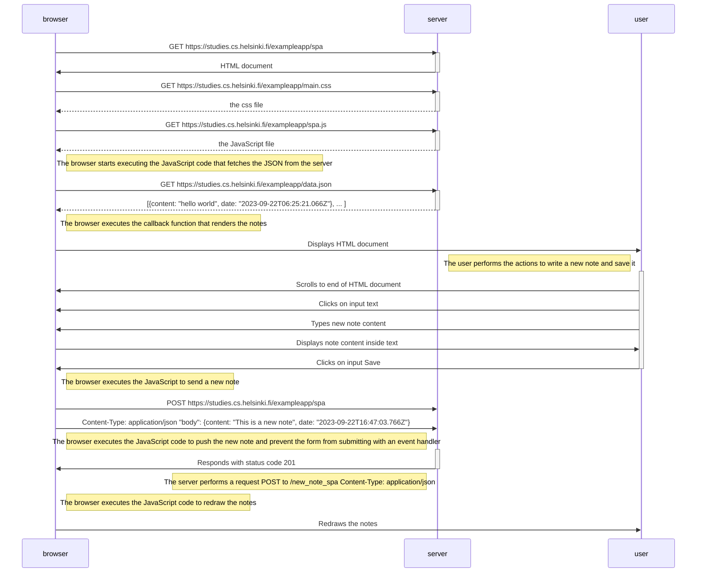

```mermaid
sequenceDiagram
  participant browser
  participant server
  participant user

  browser->>server: GET https://studies.cs.helsinki.fi/exampleapp/spa
  activate server
  server->>browser: HTML document
  deactivate server

  browser->>server: GET https://studies.cs.helsinki.fi/exampleapp/main.css
  activate server
  server-->>browser: the css file
  deactivate server

  browser->>server: GET https://studies.cs.helsinki.fi/exampleapp/spa.js
  activate server
  server-->>browser: the JavaScript file
  deactivate server

  Note right of browser: The browser starts executing the JavaScript code that fetches the JSON from the server

  browser->>server: GET https://studies.cs.helsinki.fi/exampleapp/data.json
  activate server
  server-->>browser: [{content: "hello world", date: "2023-09-22T06:25:21.066Z"}, ... ]
  deactivate server

  Note right of browser: The browser executes the callback function that renders the notes

  browser->>user: Displays HTML document

  Note left of user: The user performs the actions to write a new note and save it

  activate user
  user->>browser: Scrolls to end of HTML document
  user->>browser: Clicks on input text
  user->>browser: Types new note content
  browser->>user: Displays note content inside text
  user->>browser: Clicks on input Save
  deactivate user

  Note right of browser: The browser executes the JavaScript to send a new note

  browser->>server: POST https://studies.cs.helsinki.fi/exampleapp/spa
  browser->>server: Content-Type: application/json "body": {content: "This is a new note", date: "2023-09-22T16:47:03.766Z"}

  Note right of browser: The browser executes the JavaScript code to push the new note and prevent the form from submitting with an event handler

  activate server
  server->>browser: Responds with status code 201
  deactivate server

  Note left of server: The server performs a request POST to /new_note_spa Content-Type: application/json

  Note right of browser: The browser executes the JavaScript code to redraw the notes

  browser->>user: Redraws the notes
```
